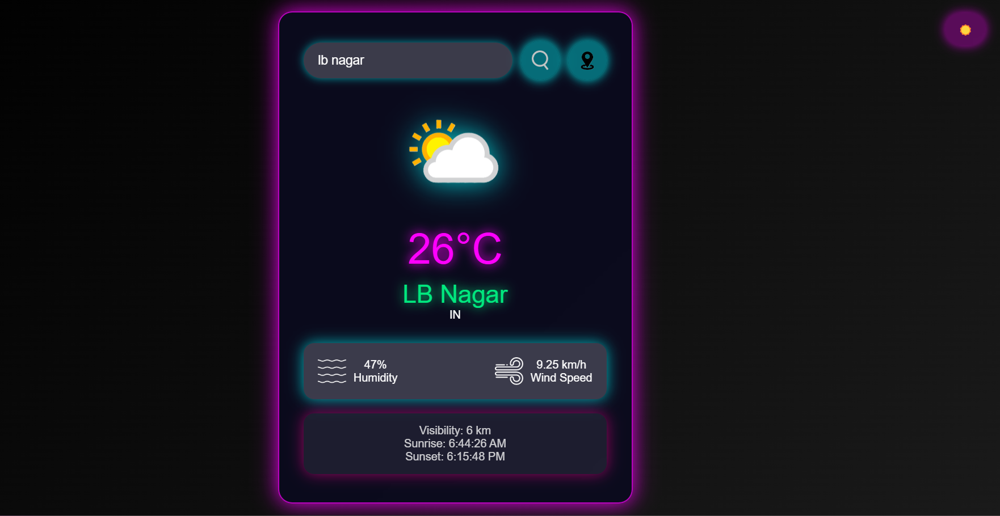
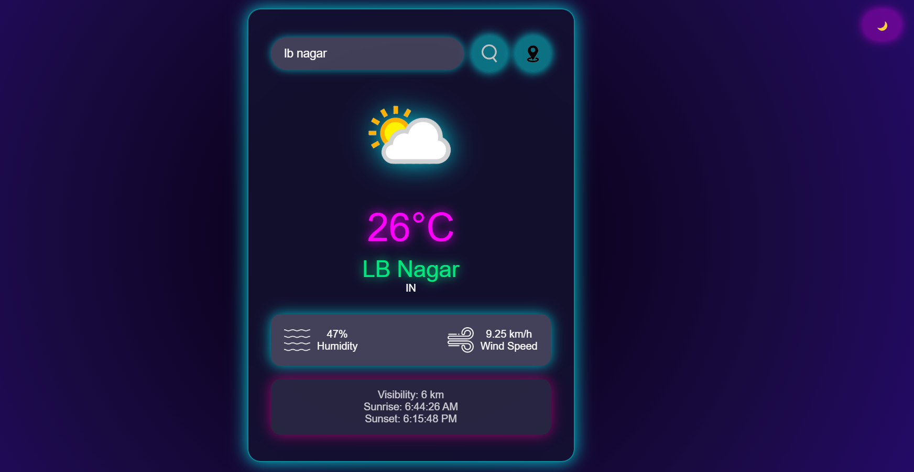

# 🌦️ Weather Dashboard  

🚀 **Intermediate-Level Project** | **Live Weather Updates** | **API Integration**  

A sleek and intuitive **Weather Dashboard** that fetches real-time weather data and presents it in a user-friendly interface. This project sharpens **API integration skills** and enhances front-end development expertise.  

---

## 📌 Features  
✅ **Search for any city** to get live weather updates  
✅ **Fetch real-time data** using an API  
✅ **Interactive UI** with a modern, responsive design  
✅ **Geolocation support** to get weather details based on your location  

---

## 📸 Screenshots  
🔹 **Live Preview of the Dashboard**  
  
  

---

## 🛠️ Tech Stack  
🔹 **HTML, CSS, JavaScript** – Frontend technologies  
🔹 **Weather API** – Fetches real-time weather data  
🔹 **Geolocation API** – Fetches user location for accurate weather details  

---

## 🚀 Getting Started  

1️⃣ **Clone the repository**  
```sh
git clone https://github.com/Kanneboinashivakumar/Advanced-Calculator.git
cd Weather Dashboard   
